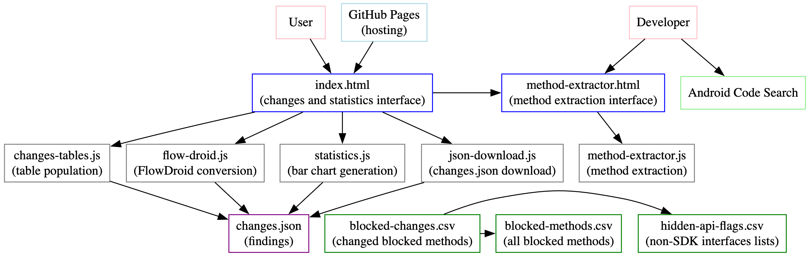

# Sources-Sinks-Android-API-35
* Fair warning: This webpage is being created by an Android developer using web development solely for this purpose.
* https://laurax64.github.io/Sources-Sinks-Android-API-35/

The hidden API CSV file is sourced from [Android's official developer guide on non-SDK interface restrictions](https://developer.android.com/guide/app-compatibility/restrictions-non-sdk-interfaces). I do not claim ownership or authorship of this file.  

## Architecture

